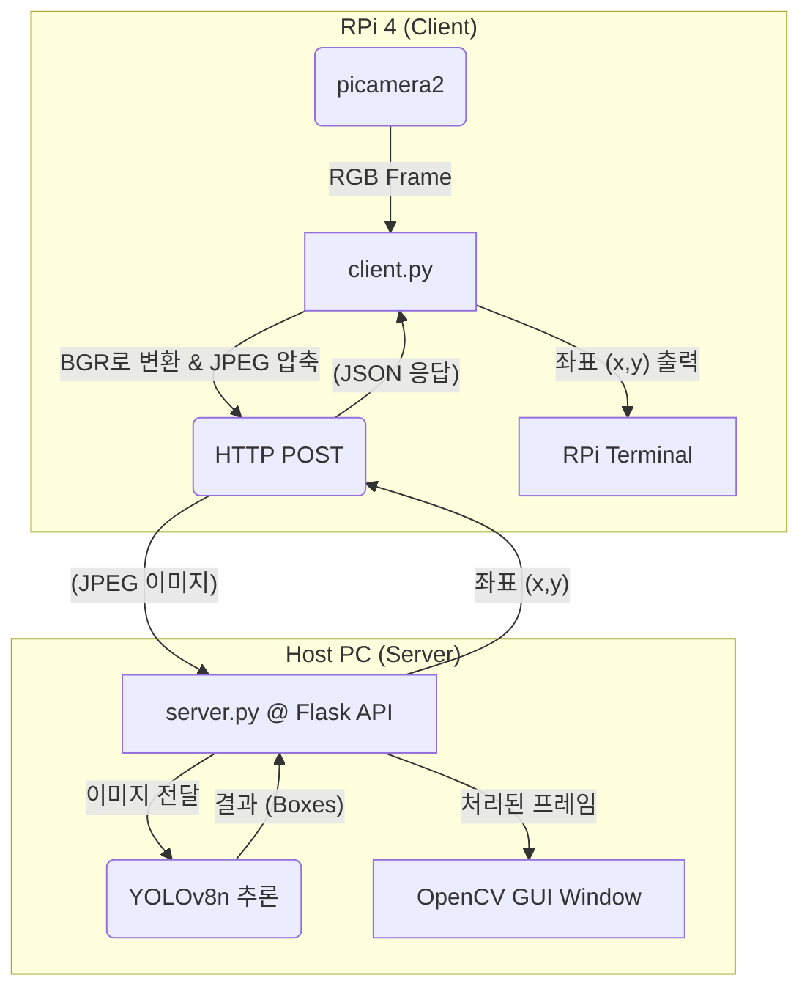

# RPi-YOLOv8 네트워크 오프로딩 프로젝트
이 프로젝트는 Raspberry Pi 4에서 실시간 YOLOv8 객체 탐지를 수행하는 시스템입니다. RPi 4의 제한된 연산 능력(약 2 FPS)을 극복하기 위해, 무거운 YOLO 추론 작업을 네트워크를 통해 강력한 호스트 PC(노트북)로 오프로딩(Offloading)합니다.

## 참고사항 및 직접 돌려본 성능
===
RPI5에서 YOLO 직접 돌리기 : [RPI5 + YOLO11n 10FPS](https://www.ejtech.io/learn/yolo-on-raspberry-pi)

환경 별 FPS 비교
* RPI3 + yolo8n_ncnn : 0.6
* RPI4 + yolo8n_ncnn : 2.1
* 오프로딩 : 200이상

## 🤖 핵심 아키텍처
===
시스템은 클라이언트-서버 모델로 작동합니다.

* **`client.py` (Raspberry Pi 4):**
    * `picamera2`를 사용해 카메라 영상을 실시간으로 캡처합니다.
    * 프레임을 `OpenCV`로 BGR 변환 및 JPEG 압축합니다.
    * `requests`를 사용해 압축된 이미지를 서버의 Flask API로 전송합니다.
    * 서버로부터 객체의 중심 좌표 `(x, y)`를 JSON으로 응답받아 터미널에 출력합니다.

* **`server.py` (호스트 PC / 노트북):**
    * `Flask`를 사용해 `/detect` 엔드포인트에서 이미지 업로드를 대기합니다.
    * `ultralytics` (YOLOv8n) 모델을 사용해 수신된 이미지에서 객체 탐지를 수행합니다.
    * 탐지된 첫 번째 객체의 중심 좌표를 JSON으로 클라이언트에 반환합니다.
    * `OpenCV`를 사용해 RPi로부터 받은 영상에 탐지 결과(바운딩 박스, FPS)를 그린 GUI 창을 실시간으로 띄웁니다.
    * Flask 서버와 OpenCV GUI가 충돌하지 않도록 **멀티스레딩(Multi-threading)**으로 구현되어 있습니다.

## 📊 시스템 흐름도
===


## ✨ 주요 기능
===
* **네트워크 오프로딩:** RPi의 한계를 넘어 실시간(고성능 PC에서 30+ FPS) 객체 탐지 가능
* **실시간 GUI:** 서버에서 RPi가 보는 화면과 탐지 결과를 실시간으로 모니터링
* **안정적인 FPS 표시:** GUI에 표시되는 FPS를 1초 평균으로 부드럽게(Smoothing) 처리
* **영상 저장:** 서버 실행 시 `--save` 옵션을 주면 탐지 결과가 포함된 영상을 `output.avi` 파일로 저장
* **동적 해상도:** 클라이언트 실행 시 `--width`와 `--height` 인자로 카메라 해상도 조절 가능
* **색상 보정:** `picamera2` (RGB)와 `OpenCV` (BGR) 간의 색상 채널 불일치 문제 해결

## 📦 필수 라이브러리 설치
===
### 💻 서버 (server.py)
===
호스트 PC (Windows/Mac/Linux)에 설치가 필요합니다.

* **`ultralytics`**: YOLOv8 모델 실행을 위한 핵심 라이브러리
* **`flask`**: RPi의 요청을 받을 경량 웹 서버
* **`opencv-python`**: 이미지 디코딩, GUI 표시, 영상 저장을 위해 필요
* **`numpy`**: `opencv-python`의 의존성 라이브러리

```bash
pip install ultralytics flask opencv-python numpy
```

### 📸 클라이언트 (client.py)
===
Raspberry Pi 4에 설치가 필요합니다.

* **OS 요구사항:** `picamera2` 라이브러리의 안정적인 호환성을 위해 **Raspberry Pi OS (64-bit)** 사용을 강력히 권장합니다.
* **`picamera2`**: RPi 카메라 모듈(v2, v3 등) 제어
* **`requests`**: 서버에 HTTP 요청을 보내기 위해 필요
* **`opencv-python`**: 이미지 압축(`imencode`) 및 색상 변환(`cvtColor`)을 위해 필요

```bash
pip install picamera2 requests opencv-python
```

## 🚀 실행 가이드
===
### 1. 네트워크 설정 (유선 연결 권장)
===
안정적인 저지연 통신을 위해 RPi와 노트북을 이더넷(LAN) 케이블로 직접 연결하는 것을 권장합니다.

1.  노트북을 **Wi-Fi**로 인터넷에 연결합니다.
2.  RPi와 노트북을 **이더넷 케이블**로 연결합니다.
3.  노트북의 Wi-Fi 설정에서 **'인터넷 연결 공유(ICS)'**를 활성화하여 이더넷 포트로 인터넷을 공유합니다.
4.  노트북의 `cmd` 또는 터미널에서 `ipconfig` (Windows) 또는 `ifconfig` (Mac/Linux)를 실행하여 **이더넷 어댑터의 IP 주소**를 확인합니다. (Windows의 경우 `192.168.137.1`일 확률이 높음)

### 2. 코드 설정
===
`client.py` 파일을 열어 `SERVER_URL` 변수의 IP 주소를 1번에서 찾은 **노트북의 이더넷 IP**로 수정합니다.

```python
# client.py

# !!! [노트북_IP_주소] 부분은 실제 IP로 설정되어 있어야 합니다.
SERVER_URL = "[http://192.168.137.1:5000/detect](http://192.168.137.1:5000/detect)"
```

### 3. 방화벽 설정 (Windows)
===
노트북의 Windows 방화벽이 `5000`번 포트를 차단할 수 있습니다.

1.  **'고급 보안이 포함된 Windows Defender 방화벽'**을 엽니다.
2.  **'인바운드 규칙'** > **'새 규칙'**을 선택합니다.
3.  **'포트'** > **'TCP'** > **'특정 로컬 포트'**에 `5000`을 입력합니다.
4.  **'연결 허용'**을 선택하고 규칙을 저장합니다.
5.  네트워크 프로필이 '공용'으로 되어있다면, '네트워크 및 인터넷' 설정 > '이더넷' > 프로필을 **'개인'**으로 변경해야 규칙이 적용됩니다.

### 4. 프로그램 실행
===
1.  **[서버]** 노트북 터미널에서 `server.py`를 실행합니다.

    ```bash
    # 기본 실행 (GUI 표시)
    python server.py
    
    # GUI 영상을 파일로 저장하며 실행
    python server.py --save
    ```

2.  **[클라이언트]** RPi 터미널에서 `client.py`를 실행합니다.

    ```bash
    # 기본 실행 (640x480)
    python client.py
    
    # 해상도를 HD(1280x720)로 지정하여 실행
    python client.py --width 1280 --height 720
    ```

3.  실행이 성공하면 노트북 화면에 RPi가 전송하는 영상과 YOLO 탐지 결과가 나타나고, RPi 터미널에는 감지된 객체의 좌표가 출력됩니다.


